<h1 align="center">Aeroplane Boarding Simulation</h1>

This is a first attempt to simulate the boarding of an aeroplane to see which order of passenger entry results in the shortest boarding time. There is also some analysis of how variables such as percentage of passengers with hand luggage, number of boarding aisles and number of boarding groups affects these boarding times. 

This simulation does not account for practices airlines implement, such as boarding first/business class passengers first and other priority boarding systems, neither does it account for how the passengers rate the boarding experience.

The Mythbusters did an experiment to measure the time taken to board using different methods in a more real world setting, and, as they used people, how passengers rated those boarding methods. A summary of their findings can be found [here](https://travelupdate.com/mythbusters-boarding-styles/).

<h1 align="center">Boarding Methods</h1>

A combination of boarding methods are used ranging from completely random to where the exact order is specified. Below is a summary of the standard version of each method. Similar summaries are available for versions of these methods with either 2 boarding aisles or grouped boarding in the boarding_methods folder.

Each simulation takes the following arguments:
- rows - the number of rows the aeroplane has
- abreast - the seat configuration. 3,3 means 3 seats, aisle, 3 seats (shown below). 2,3,2 means 2 seats, aisle, 3 seats, aisle, 2 seats.
- boarding_method - one of the seven methods shown below
- bag_percent - the percentage of passengers with hand luggage.
- slow_average_fast - the percentage of passengers who are slow, average and fast at putting their hand luggage away. Slow, average, and fast passengers take 3, 2, and 1 steps respectively to put their bags in the overhead compartment. Passengers without hand luggage take 0 steps.
- n_groups - the number of groups passengers board in. This only has an effect on front-to-back, back-to-front, front WMA and reverse WMA methods. A more detailed descriptions can be found in the boarding_methods folder.

### Back-to-front
Passengers enter the plane in order of their row, starting with the last row. Within each row, the order of the passengers is random.  
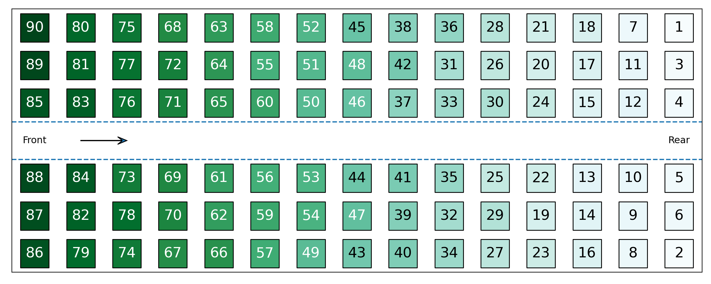

### Front-to-back
Passengers enter the plane in order of their row, starting with the first row. Within each row, the order of the passengers is random.  
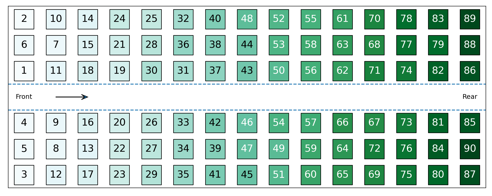

### Window-middle-aisle
Passengers enter the plane starting by window seats and moving towards ailse seats. Within each aisle, passengers enter in a random order.  
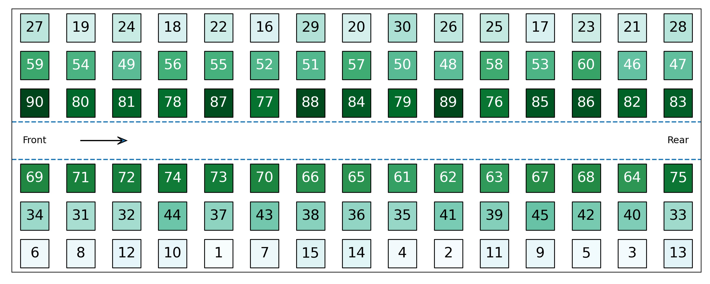

### Back-to-front window-middle-aisle
Passengers enter the plane in order of their row, starting with the last row. Within each row, passengers are sorted from window seats to aisle seats.  
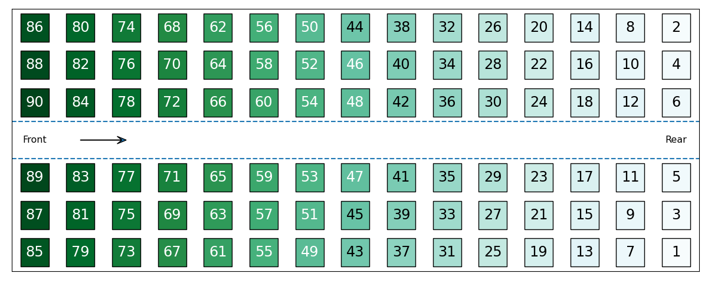

### Front-to-back window-middle-aisle
Passengers enter the plane in order of their row, starting with the first row. Within each row, passengers are sorted from window seats to aisle seats.  
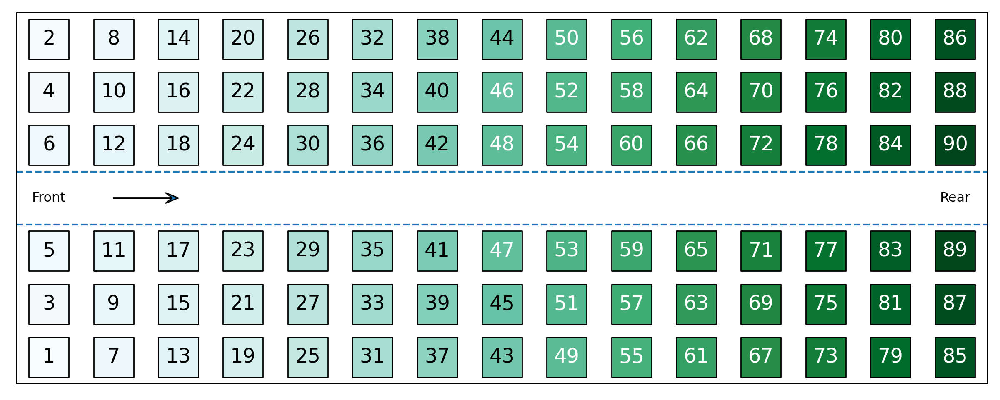

### Random
Passengers enter the plane in a random order.  
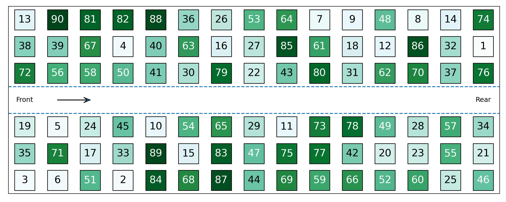

### Optimal
Passengers enter the plane sorted by aisle and row. Passengers from one window aisle enter, starting with the rear row. The other window aisle follows. Then the next aisle in etc.  
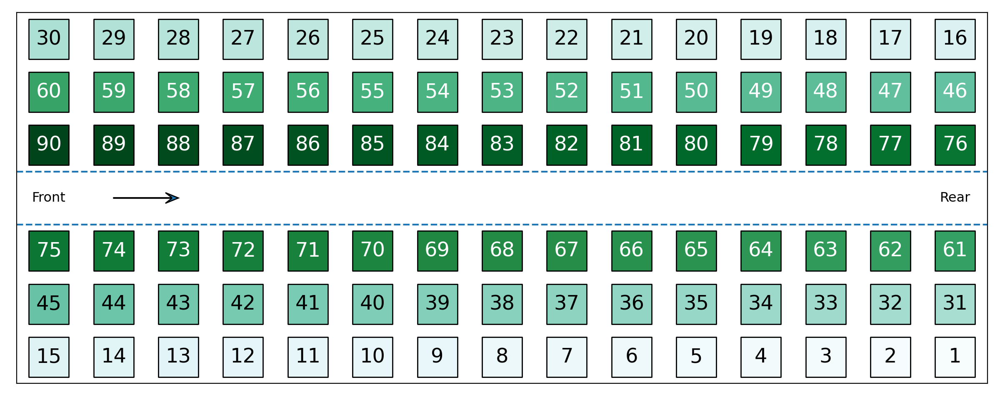

<h1 align="center">Analysis</h1>

### Steps per boarding method by bag percentage

The boxplot below shows the results of running each boarding method 1,000 times for each percentage of passengers with bags.

For all boarding methods in this model, the number of steps taken to board decreases as the percentage of passengers with bags decreases. The magnitude of the change between different bag percentages varies across methods, with the front-to-back and back-to-front methods showing a significant decrease in boarding steps as bag percentage decreases, whereas the optimal method shows only a very small decrease.

On average, the opitmal boarding method is the fastest at all bag percentages other than 0%, where the reverse WMA method is as fast. The two methods which start boarding from the front rows are the slowest.  

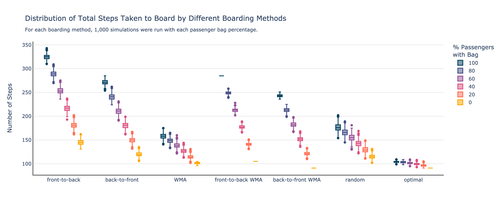

To take a closer look at the magnitudes of the effects the change in the percentage of passengers with hand luggage has on the boarding time, the plot below shows OLS regression lines for each of the boarding methods. 

The effect is smallest on the optimal boarding method where a 10% point change in percentage of passengers with hand luggage ($p$) is associated with a 1.3 step ($s$) increase in boarding time. The front-to-back method is the one affected most where a 10% point change in the percentage of passengers with hand luggage is associated with an 18 step increase in boarding time.

The four methods most affected by a change in bag percentage were those where all passengers in one row boarding before the passengers in the next row boarded. This means slow passengers have far more of an effect as they are far more likely to be blocking the passengers behind them from reaching their seat. The effect of reducing the number of passengers who are slow to put their bags away is therefore more pronounced in these methods than in the other three.  

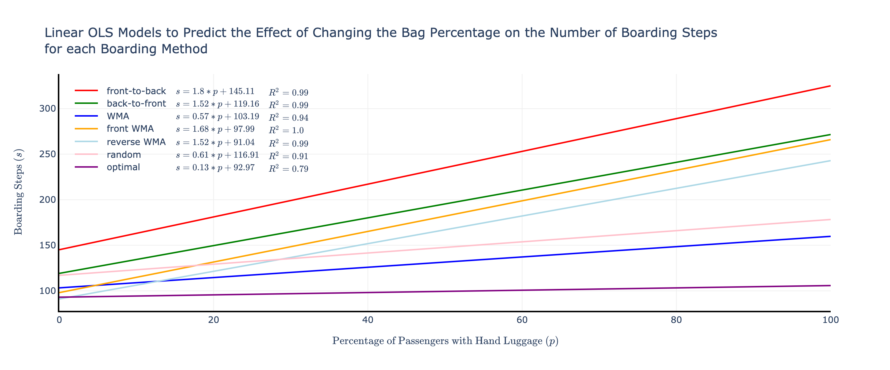

### Steps per boarding method by number of aisles

The chart below shows the results from running each boarding method 1,000 times for two different arrangements of six seats per row. One arrangement has two aisles and the second has one.

As expected, the addition of a second boarding aisle with the same number of seats cuts the number of steps down by approximately half for all boarding methods. The variation in the boarding steps also decreases for almost all boarding methods. (Needs explanation.)  

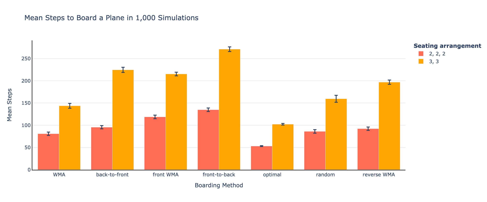

### Steps per boarding method by number of groups

Finally, four methods can be adapted by allowing passengers to board within groups of a certain size. This introduces an additional element of randomness to the boarding process.

In the cases below where 70% of passengers have bags, a reduction in the number of boarding groups (i.e. more random boarding) leads to a reduction in the number of steps. (Needs explanation and to be tested with other bag percentages).  

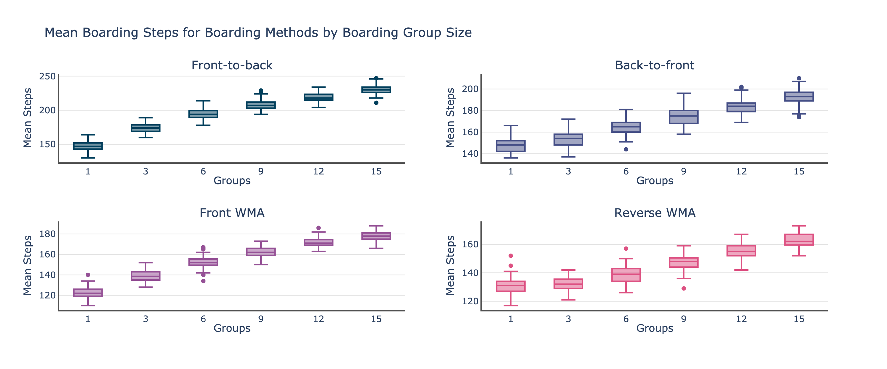