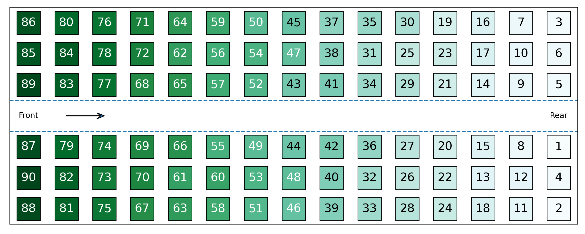
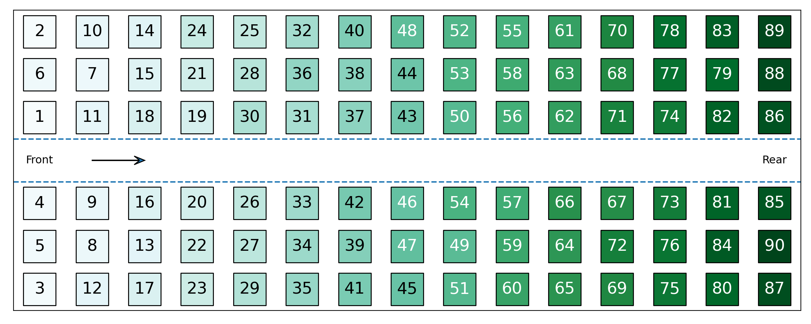
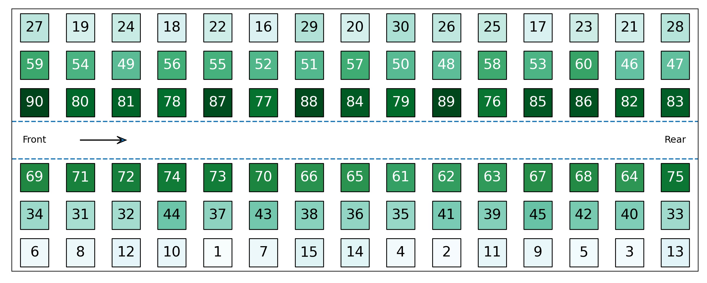
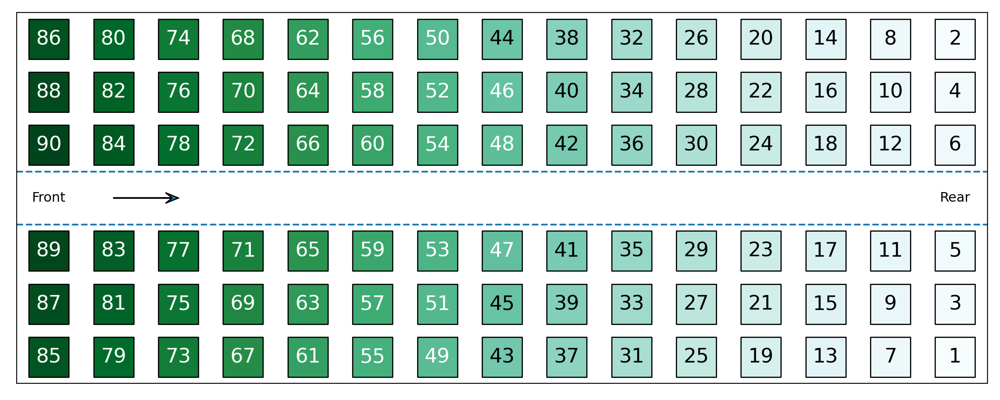
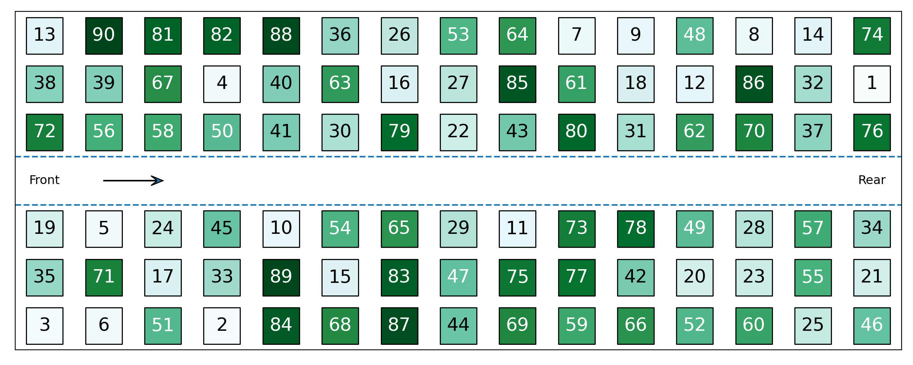
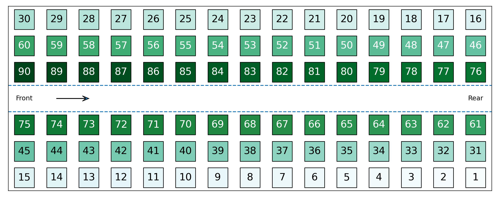

# Aeroplane Boarding

This is a first attempt to simulate the boarding of an aeroplane to see which order of passenger entry results in the shortest boarding time. This simulation does not account for practices airlines implement, such as boarding first/business class passengers first and other priority boarding systems, neither does it account for how the passengers rate the boarding experience.

The Mythbusters did an experiment to measure the time taken to board using different methods in a more real world setting, and, as they used people, how passengers rated those boarding methods. A summary of their findings can be found [here](https://travelupdate.com/mythbusters-boarding-styles/).

## Boarding Methods

The following provide a description of the boarding methods and illustrations of the order in which passengers board in each method. All passengers board from the front, with passenger 1 boarding first and, in this set up, passenger 90 boarding last.

#### Back-to-front
Passengers enter the plane in order of their row, starting with the last row. Within each row, the order of the passengers is random.

#### Front-to-back
Passengers enter the plane in order of their row, starting with the first row. Within each row, the order of the passengers is random.

#### Window-middle-aisle
Passengers enter the plane starting by window seats and moving towards ailse seats. Within each aisle, passengers enter in a random order.

#### Back-to-front window-middle-aisle
Passengers enter the plane in order of their row, starting with the last row. Within each row, passengers are sorted from window seats to aisle seats.

#### Front-to-back window-middle-aisle
Passengers enter the plane in order of their row, starting with the first row. Within each row, passengers are sorted from window seats to aisle seats.

#### Random
Passengers enter the plane in a random order.

#### Optimal
Passengers enter the plane sorted by aisle and row. Passengers from one window aisle enter, starting with the rear row. The other window aisle follows. Then the next aisle in etc.

## Simulations

### Steps per boarding method by bag percentage

The boxplot below shows the results of running each boarding method 1,000 times for each percentage of passengers with bags.

For all boarding methods in this model, the number of steps taken to board decreases as the percentage of passengers with bags decreases. The magnitude of the change between different bag percentages varies across methods, with the front-to-back and back-to-front methods showing a significant decrease in boarding steps as bag percentage decreases, whereas the optimal method shows only a very small decrease.

On average, the opitmal boarding method is the fastest at all bag percentages other than 0%, where the reverse WMA method is as fast. The two methods which start boarding from the front rows are the slowest.

### Steps per boarding method by number of aisles

The chart below shows the results from running each boarding method 1,000 times for two different arrangements of six seats per row. One arrangement has two aisles and the second has one.

As expected, the addition of a second boarding aisle with the same number of seats cuts the number of steps down by approximately half for all boarding methods. The variation in the boarding steps also decreases for almost all boarding methods. (Needs explanation.)

### Steps per boarding method by number of groups

Finally, four methods can be adapted by allowing passengers to board within groups of a certain size. This introduces an additional element of randomness to the boarding process.

In the cases below where 70% of passengers have bags, a reduction in the number of boarding groups (i.e. more random boarding) leads to a reduction in the number of steps. (Needs explanation and to be tested with other bag percentages).

