# Boarding Methods

The following provide a description of the different boarding methods and illustrate the order in which passengers board in each method. All passengers board from the front, with passenger 1 boarding first and, in these set ups, either passenger 90 or 105 boarding last.

Animations of boardings using each method can be found in the boarding_animations folder.

## Standard Setup

In the standard setup, there is one boarding aisle and the passengers are not grouped.

#### Back-to-front
Passengers enter the plane in order of their row, starting with the last row. Within each row, the order of the passengers is random.

#### Front-to-back
Passengers enter the plane in order of their row, starting with the first row. Within each row, the order of the passengers is random.

#### Window-middle-aisle
Passengers enter the plane starting by window seats and moving towards ailse seats. Within each aisle, passengers enter in a random order.

#### Back-to-front window-middle-aisle
Passengers enter the plane in order of their row, starting with the last row. Within each row, passengers are sorted from window seats to aisle seats.

#### Front-to-back window-middle-aisle
Passengers enter the plane in order of their row, starting with the first row. Within each row, passengers are sorted from window seats to aisle seats.
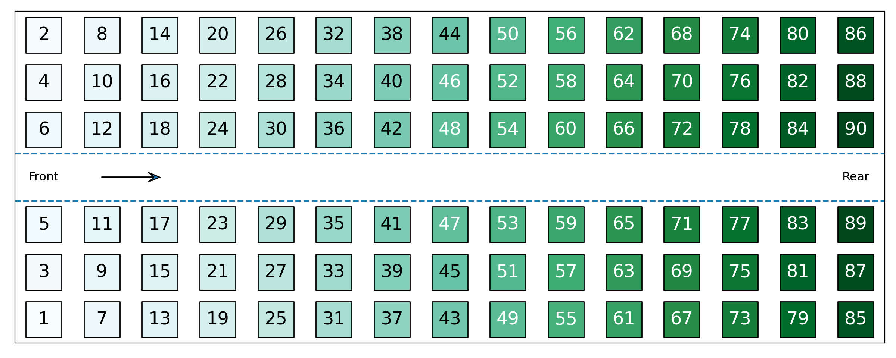

#### Random
Passengers enter the plane in a random order.

#### Optimal
Passengers enter the plane sorted by aisle and row. Passengers from one window aisle enter, starting with the rear row. The other window aisle follows. Then the next aisle in etc.

## 2 Aisles Setup

In this setup, there are two boarding aisles. Passengers will board via the aisle closest to their seat. When the two aisles are equidistant, as they are for the middle seats in the following examples, the boarding aisle for each passenger is assigned at random. 

#### Back-to-front
Passengers enter the plane in order of their row, starting with the last row. Within each row, the order of the passengers is random.
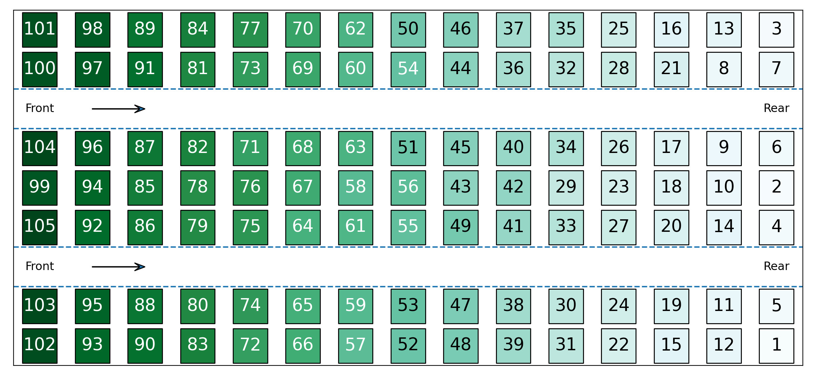

#### Front-to-back
Passengers enter the plane in order of their row, starting with the first row. Within each row, the order of the passengers is random.
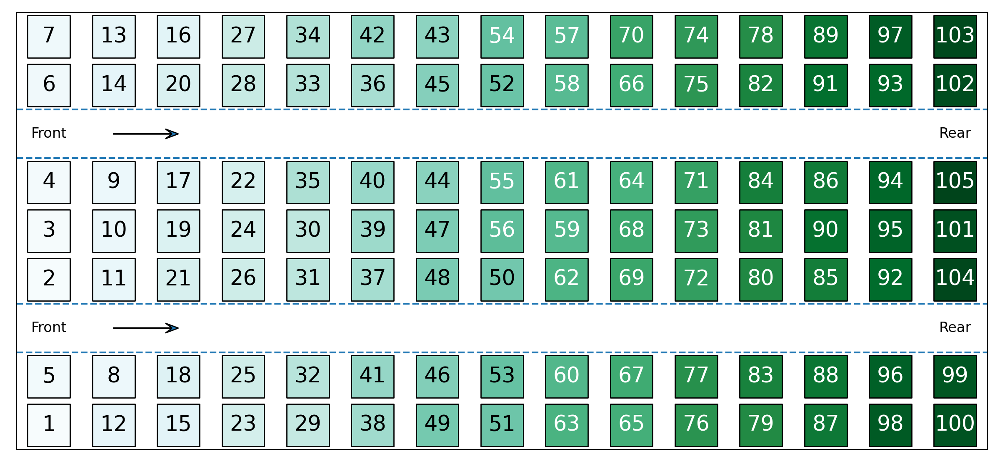

#### Window-middle-aisle
Passengers enter the plane starting by window seats and moving towards ailse seats. Within each aisle, passengers enter in a random order.
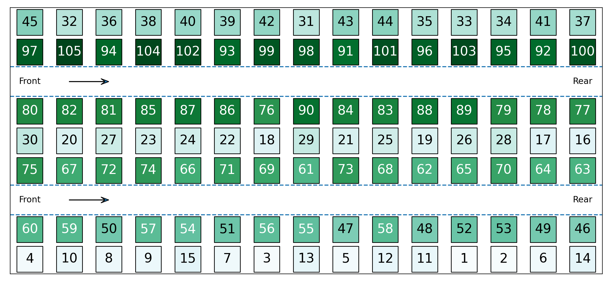

#### Back-to-front window-middle-aisle
Passengers enter the plane in order of their row, starting with the last row. Within each row, passengers are sorted from window seats to aisle seats.
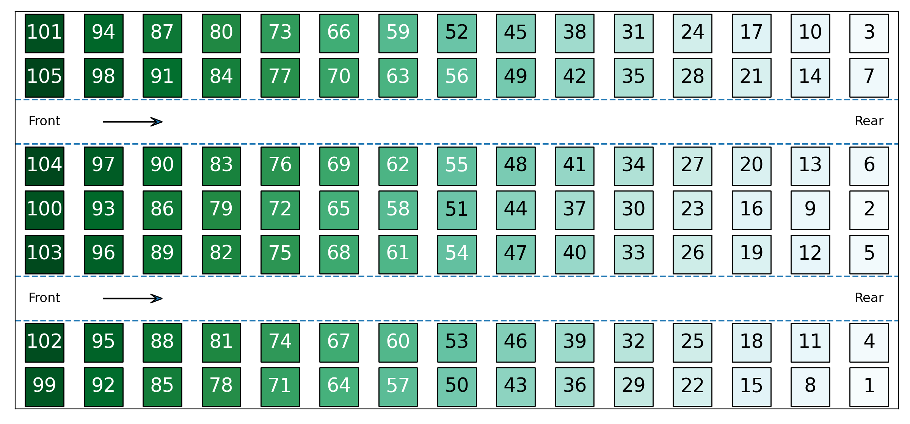

#### Front-to-back window-middle-aisle
Passengers enter the plane in order of their row, starting with the first row. Within each row, passengers are sorted from window seats to aisle seats.
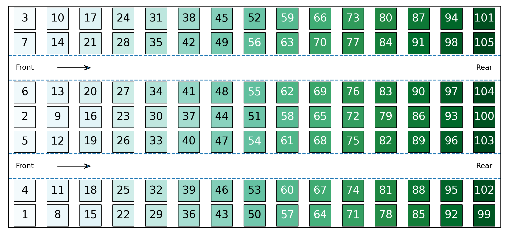

#### Random
Passengers enter the plane in a random order.
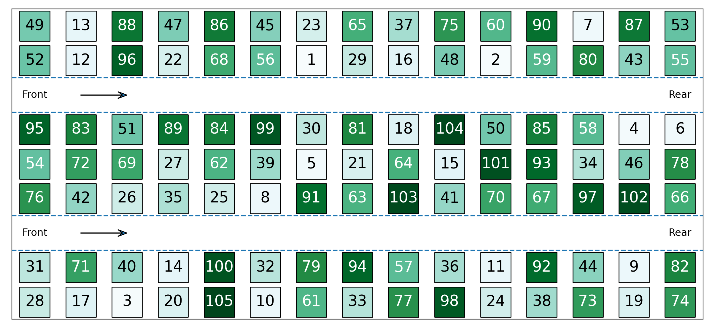

#### Optimal
Passengers enter the plane sorted by aisle and row. Passengers from one window aisle enter, starting with the rear row. The other window aisle follows. Then the next aisle in etc.
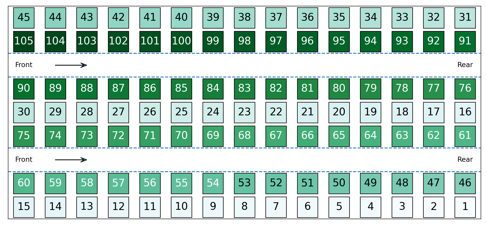

## Grouped Setup

Boarding is often done in groups, as opposed to strictly by one row/aisle at a time. Therefore, four of the boarding methods are adapted so that the boarding order is random within the boarding group.

#### Back-to-front
Passengers are grouped by their row and enter starting with the rear group. Within each group, the order of the passengers is random. The below example shows passengers split into 3 groups.
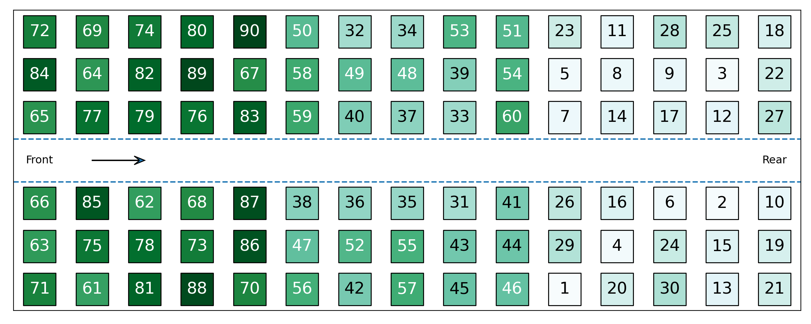

#### Front-to-back
Passengers are grouped by their row and enter starting with the front group. Within each group, the order of the passengers is random. The below example shows passengers split into 3 groups.
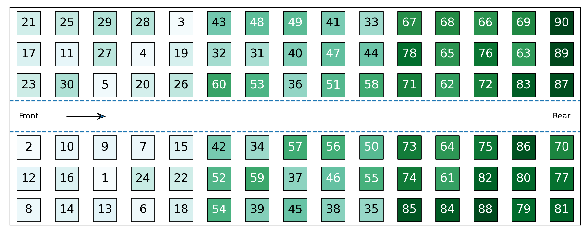

#### Back-to-front window-middle-aisle
Passengers are grouped by their row and enter starting with the rear group. Within each group, the window passengers enter first, followed by the middle passengers and lastly the aisle passengers. The row order is random within each group. The below example shows passengers split into 3 groups.

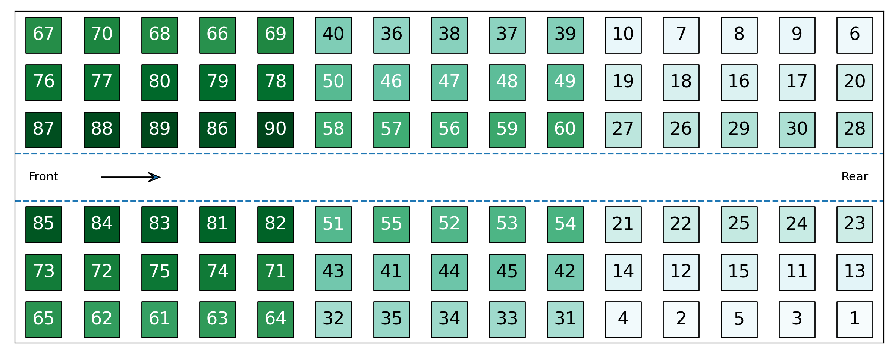

#### Front-to-back window-middle-aisle
Passengers are grouped by their row and enter starting with the front group. Within each group, the window passengers enter first, followed by the middle passengers and lastly the aisle passengers. The row order is random within each group. The below example shows passengers split into 3 groups.
